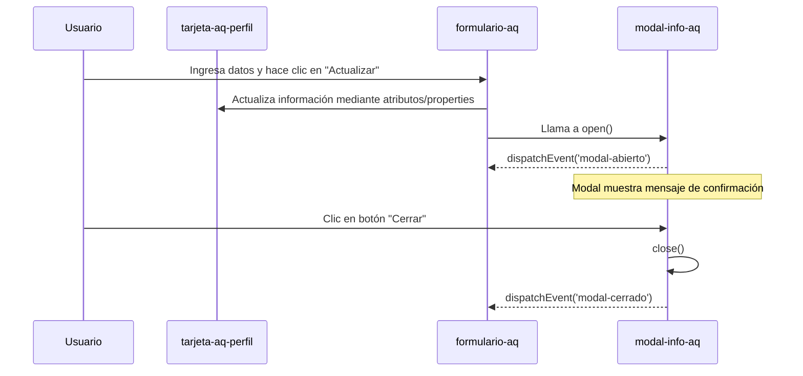

Reporte Técnico — Componente Web ```<tarjeta-aq-perfil>```, ```<formulario-aq>``` y ```<modal-info-aq>```

---

Autor: Quizhpe Cuzme Alexander Miguel  
Tarea: Implementar Especificaciones Avanzadas en Web Components
Fecha: Mayo 2025  

---

## 🎯 Objetivo

Desarrollar una solución web reutilizable basada en Web Components utilizando las especificaciones avanzadas de la plataforma:  
- Shadow DOM para encapsulamiento.  
- `<template>` para estructura reutilizable.  
- Slots con contenido predeterminado.  
- Emisión y escucha de eventos personalizados.  
- Modularización con ES Modules (`import/export`).  

El proyecto consiste en una **interfaz de perfil editable** compuesta por tres componentes:

1. Una **tarjeta de presentación** (`<tarjeta-aq-perfil>`)
2. Un **formulario de edición** (`<formulario-aq>`)
3. Un **modal de notificación** (`<modal-info-aq>`)

---

## 🧩 Componentes Personalizados

### 1. `<tarjeta-aq-perfil>`

**Función:** Mostrar información personal del usuario en una tarjeta visual.  
**Características Técnicas:**
- Usa `Shadow DOM` para estilos aislados.
- Usa un `<template>` para definir la estructura base.
- Emplea múltiples `slots` para contenido dinámico y de respaldo.
- Permite cambiar la **posición de la imagen**, el **tema de color** y la imagen de perfil mediante atributos.

**Slots implementados:**
- `nombre`
- `estudio` (nombre de universidad)
- `carrera`
- `edad`

**Atributos personalizados:**
- `imagen` (URL)
- `tema` (color de fondo)
- `lado` (posición de la imagen: `izquierda` o `derecha`)

---

### 2. `<formulario-aq>`

**Función:** Recopilar datos del usuario y actualizar la tarjeta.  
**Características Técnicas:**
- Usa `Shadow DOM` con campos estilizados.
- El botón de envío está expuesto mediante `slot name="boton-enviar"` para personalización externa.
- Al hacer clic, accede a `<tarjeta-aq-perfil>` mediante `document.getElementById` y actualiza:
  - Los atributos (`imagen`, `tema`, `lado`)
  - El contenido de los `slots` (`nombre`, `estudio`, `carrera`, `edad`)
- También invoca el método `open()` del componente modal para mostrar la notificación.

---

### 3. `<modal-info-aq>`

**Función:** Mostrar un mensaje flotante como confirmación de acción.  
**Características Técnicas:**
- Basado en un `<template>` reutilizable.
- Incluye slots con contenido predeterminado:
  - `titulo`
  - `contenido`
  - `acciones`
- Usa `Shadow DOM` para estilos encapsulados.
- Emite dos eventos personalizados:
  - `modal-abierto` (al ejecutarse `.open()`)
  - `modal-cerrado` (al ejecutarse `.close()`)
- El método `open()` muestra el modal y dispara el evento.
- El método `close()` oculta el modal y también emite un evento.

---

## 🔁 Modularización

Cada componente está separado en su propio archivo `.js` y se importa en el archivo principal:

```js
// main.js
import { TarjetaPerfil } from './tarjeta-aq-perfil.js';
import { FormularioAQ } from './formulario-aq.js';
import { ModalInfo } from './espeModal.js';
```

Esto permite **escalabilidad**, **reutilización** y mantenimiento limpio de código.

---

## 🔄 Comunicación entre Componentes

### 📊 Diagrama Mermaid



---

### 🧠 Flujo Detallado

1. **Usuario** ingresa datos personales en el componente `<formulario-aq>`.
2. Al presionar el botón, el formulario:
   - Establece atributos y slots del componente `<tarjeta-aq-perfil>`.
   - Llama al método `.open()` del componente `<modal-info-aq>`.
3. El componente modal se muestra y emite el evento `modal-abierto`, útil para rastrear o mostrar logs si se desea.
4. El modal presenta un mensaje de confirmación con slots personalizados.
5. Al hacer clic en el botón “Cerrar”, el modal se oculta y emite `modal-cerrado`.

---

## 🖼️ Capturas de Ejemplo

Se incluyen en la carpeta `docs/`:

- `formulario.png` → muestra la vista del formulario editable.
- `tarjeta.png` → muestra la tarjeta con la información del perfil.
- `modal.png` → muestra el modal flotante con mensaje de confirmación.
- `diagrama-comunicacion.svg` → versión del diagrama Mermaid exportada a imagen.

---

## ✅ Conclusión

Este proyecto demuestra la aplicación de **especificaciones avanzadas de Web Components** en una arquitectura moderna, sin dependencias externas. Se logró:

- Encapsular estilos con Shadow DOM.
- Usar `<template>` para separar lógica de presentación.
- Permitir personalización mediante `slots` y `atributos`.
- Modularizar cada funcionalidad mediante `import/export`.
- Controlar la interfaz con **eventos personalizados**.

La solución es **100% nativa**, **reutilizable**, y puede integrarse fácilmente en proyectos mayores.