Reporte Técnico — Componente Web ```<tarjeta-aq-perfil>```, ```<formulario-aq>``` y ```<modal-info-aq>```

---

Autor: Quizhpe Cuzme Alexander Miguel  
Tarea: Implementar Especificaciones Avanzadas en Web Components
Fecha: Mayo 2025  

---

## 🎯 Objetivo

Diseñar e integrar dos componentes personalizados usando Web Components con Shadow DOM, permitiendo que un formulario de entrada controle dinámicamente el contenido visual de una tarjeta de perfil.

---

## 🧩 Componentes Personalizados

### 1. ```<tarjeta-aq-perfil>```

Este componente representa una tarjeta visual informativa. Tiene soporte para slots dinámicos y atributos personalizados.

#### Características:
- Atributos: `imagen`, `tema`, `lado`
- Slots:
  - `nombre`
  - `estudio` (universidad)
  - `carrera`
  - `edad`

El contenido se actualiza automáticamente cuando se cambian los atributos o el contenido de los slots.

---

### 2. `<formulario-aq>`

Este componente encapsula un formulario dentro de un Shadow DOM. Está diseñado para enviar datos al componente `<tarjeta-aq>` y actualizar su presentación.

#### Campos del formulario:
- Nombre (`text`)
- Universidad (`text`)
- Carrera (`text`)
- Edad (`text`)
- Imagen (`text`, URL)
- Color (`color picker`)
- Lado de la imagen (`select` con opciones "izquierda" y "derecha")

#### Funcionalidad:
- El botón `slot="boton-enviar"` lanza un evento que accede a la tarjeta con `id="perfil"` y actualiza sus atributos y contenido de slots directamente desde los valores ingresados.

---

## 🧩 Comunicación entre tarjeta-aq-perfil, formulario-aq y modal-info-aq

```mermaid
sequenceDiagram
    participant Usuario
    participant Tarjeta as tarjeta-aq-perfil
    participant Formulario as formulario-aq
    participant Modal as modal-info-aq

    Usuario->>Formulario: Ingresa datos y hace clic en "Actualizar"
    Formulario->>Tarjeta: Actualiza información mediante atributos/properties
    Formulario->>Modal: Llama a open()
    Modal-->>Formulario: dispatchEvent('modal-abierto')
    
    Note over Modal: Modal muestra mensaje de confirmación

    Usuario->>Modal: Clic en botón "Cerrar"
    Modal->>Modal: close()
    Modal-->>Formulario: dispatchEvent('modal-cerrado')
```


---

## Conclusión

Se logró integrar exitosamente dos Web Components con Shadow DOM mediante atributos, slots y manipulación del DOM. La arquitectura es escalable, reutilizable y completamente nativa, sin dependencias externas.